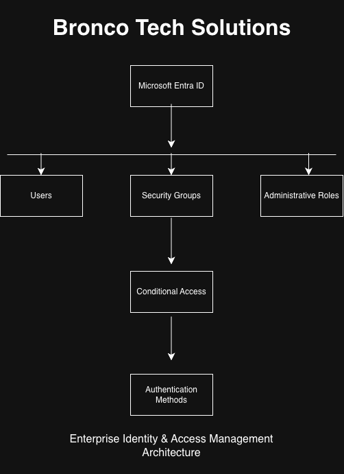
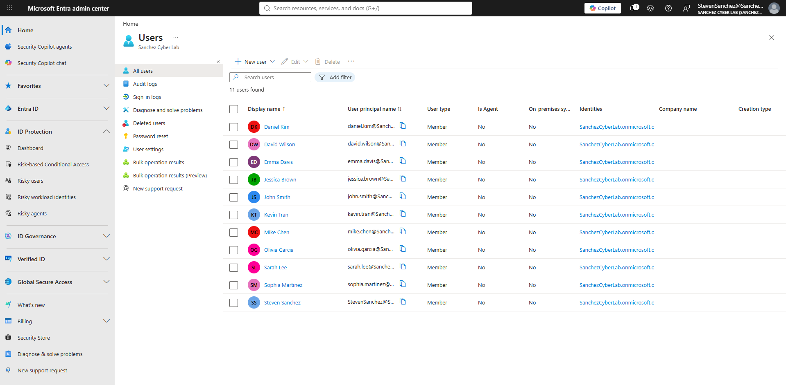
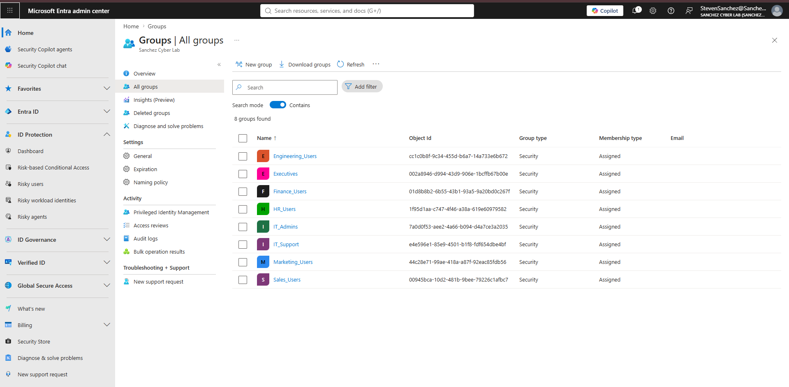
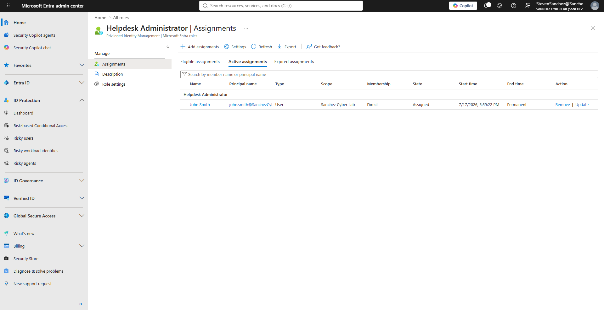
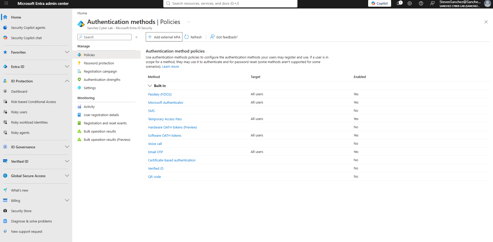
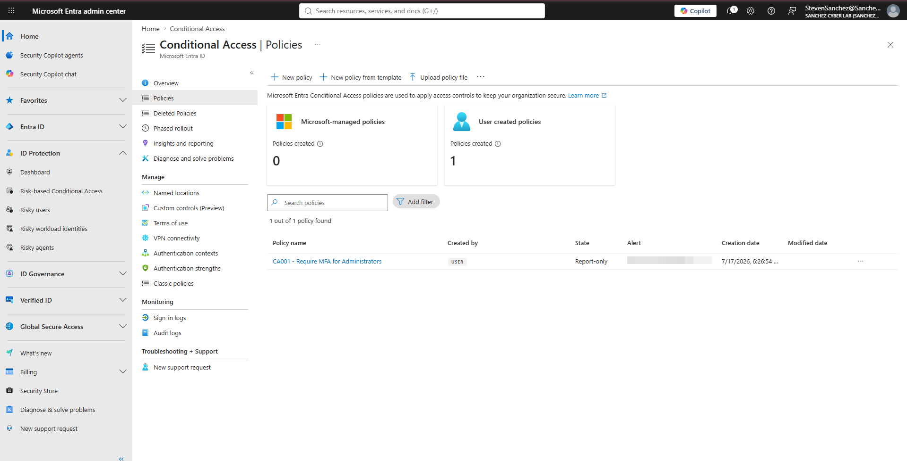

# Enterprise Identity & Access Management (IAM) Lab

## Overview

This project is a hands-on Microsoft Entra ID lab where I built a simulated Identity & Access Management (IAM) environment for a fictional company called BroncoTech Solutions.

The goal of this project was to better understand how organizations manage users, control access, and secure identities using Microsoft Entra ID. Throughout this project, I completed common IAM tasks such as user provisioning, security group management, administrative role assignments, authentication methods, and Conditional Access.

---

## Business Scenario

BroncoTech Solutions is a fictional technology company with approximately 200 employees.

For this project, I simulated the responsibilities of an IAM Analyst by:

- Creating employee accounts
- Managing user identities
- Creating security groups
- Assigning users to security groups
- Assigning administrative roles
- Reviewing authentication methods
- Creating a Conditional Access policy

---

## Technologies Used

- Microsoft Entra ID
- Microsoft Entra ID P2
- Microsoft Entra Admin Center
- Conditional Access
- GitHub

---

## Architecture

The diagram below provides a high-level overview of the IAM environment built for BroncoTech Solutions.

---

## Project Components

- Identity Foundation
- Security Groups
- User Group Assignments
- Administrative Roles
- Authentication Methods
- Conditional Access

---

## Skills Demonstrated

- Identity & Access Management (IAM)
- Microsoft Entra ID
- User Provisioning
- Role-Based Access Control (RBAC)
- Security Groups
- Administrative Role Management
- Conditional Access
- Authentication Methods
- Principle of Least Privilege

---

# Phase 1 – Identity Foundation

## Objective

Create the initial identity structure for BroncoTech Solutions.

### Tasks Completed

- Created enterprise user accounts
- Assigned Microsoft Entra ID P2 licenses
- Configured user profile information
- Used a standardized username naming convention
- Verified successful account creation

### What I Learned

This phase helped me understand how organizations provision user accounts and why identity management is the first step before assigning access and permissions.

---

# Phase 2 – Security Groups

## Objective

Create department-based security groups to organize users and simplify access management.

### Security Groups Created

- IT_Admins
- IT_Support
- HR_Users
- Finance_Users
- Sales_Users
- Marketing_Users
- Engineering_Users
- Executives

### Tasks Completed

- Created department security groups
- Used a consistent naming convention
- Designed the environment using Role-Based Access Control (RBAC)

### What I Learned

I learned that organizations assign permissions through security groups instead of assigning permissions directly to individual users. This approach makes user management easier, more scalable, and easier to maintain.

---

# Phase 3 – User Group Assignments

## Objective

Assign users to the appropriate department security groups.

### Tasks Completed

- Assigned users to department security groups
- Applied Role-Based Access Control (RBAC)
- Organized access based on job responsibilities

### What I Learned

This phase showed me how security groups simplify onboarding, offboarding, and role changes while following the Principle of Least Privilege.

---

# Phase 4 – Administrative Roles

## Objective

Assign administrative roles based on job responsibilities.

### Tasks Completed

- Assigned the Helpdesk Administrator role
- Assigned the User Administrator role
- Limited administrative access based on business needs

### What I Learned

I learned that administrative roles should only be assigned when necessary instead of giving every IT employee full administrative privileges.

---

# Phase 5 – Authentication Methods

## Objective

Review the authentication methods available in Microsoft Entra ID.

### Tasks Completed

- Reviewed available authentication methods
- Learned how organizations manage secure sign-in options for users

### What I Learned

This phase helped me understand how organizations control which authentication methods users are allowed to use while balancing security and usability.

---

# Phase 6 – Conditional Access

## Objective

Create a Conditional Access policy to require Multi-Factor Authentication (MFA).

### Tasks Completed

- Created **CA001 – Require MFA for Administrators**
- Configured the policy in **Report-only** mode
- Learned how organizations safely test security policies before enabling them

### What I Learned

This phase introduced me to Conditional Access and how organizations use it to strengthen security without immediately impacting users. Using Report-only mode allows administrators to evaluate policies before enforcing them.

# Screenshots

## User Provisioning

The image below shows the enterprise user accounts created for BroncoTech Solutions.

---

## Security Groups

The image below shows the department-based security groups used throughout the environment.

---

## Administrative Role Assignment

The image below shows the Helpdesk Administrator role assignment.

---

## Authentication Methods

The image below shows the authentication methods configured for the environment.

---

## Conditional Access

The image below shows the Conditional Access policy created during this project.

---

# Overall Takeaways

This project gave me hands-on experience with many of the core responsibilities of an IAM analyst. Before building this lab, I understood many of these concepts from studying for Security+, but completing each phase gave me a much better understanding of how they work together in an enterprise IAM environment.

Some of the biggest concepts I learned were user provisioning, Role-Based Access Control (RBAC), administrative role management, authentication methods, Conditional Access, and the Principle of Least Privilege.
